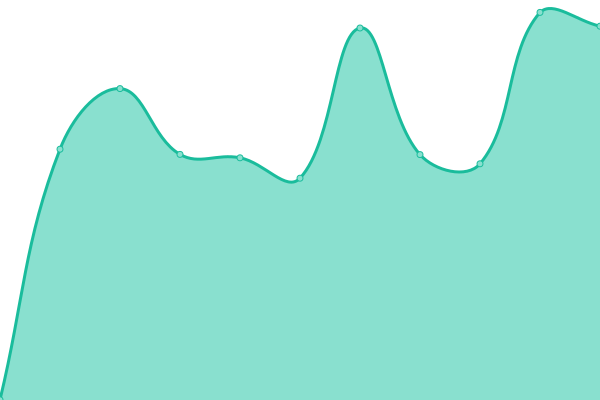
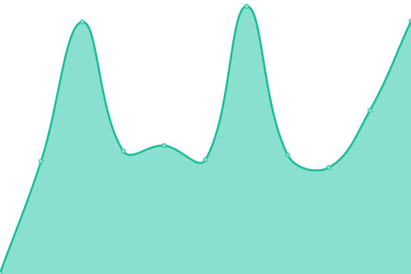

# [📈 Live Status](https://demo.upptime.js.org): <!--live status--> **🟩 All systems operational**

This repository contains the open-source uptime monitor and status page for [Upptime](https://upptime.js.org), powered by [Upptime](https://github.com/upptime/upptime).

With [Upptime](https://upptime.js.org), you can get your own unlimited and free uptime monitor and status page, powered entirely by a GitHub repository. We use [Issues](https://github.com/upptime/upptime/issues) as incident reports, [Actions](https://github.com/upptime/upptime/actions) as uptime monitors, and [Pages](https://demo.upptime.js.org) for the status page.

<!--start: status pages-->
<!-- This summary is generated by Upptime (https://github.com/upptime/upptime) -->
<!-- Do not edit this manually, your changes will be overwritten -->

| URL                                      | Status | History                                                                            | Response Time                                                                | Uptime                                                                                                                                                                                                     |
| ---------------------------------------- | ------ | ---------------------------------------------------------------------------------- | ---------------------------------------------------------------------------- | ---------------------------------------------------------------------------------------------------------------------------------------------------------------------------------------------------------- |
| [Website](https://www.seven-ig.de)       | 🟩 Up  | [website.yml](https://github.com/c0ball/Uptime/commits/master/history/website.yml) |  748ms |  |
| [Forum](https://www.seven-ig.de/phpBB3/) | 🟩 Up  | [forum.yml](https://github.com/c0ball/Uptime/commits/master/history/forum.yml)     |  293ms   |      |
| Cobal                                    | 🟩 Up  | [cobal.yml](https://github.com/c0ball/Uptime/commits/master/history/cobal.yml)     |  1079ms  |      |

<!--end: status pages-->

[**Visit our status website →**](https://demo.upptime.js.org)

## 📄 License

- Code: [MIT](./LICENSE) © [Upptime](https://upptime.js.org)
- Data in the `./history` directory: [Open Database License](https://opendatacommons.org/licenses/odbl/1-0/)
