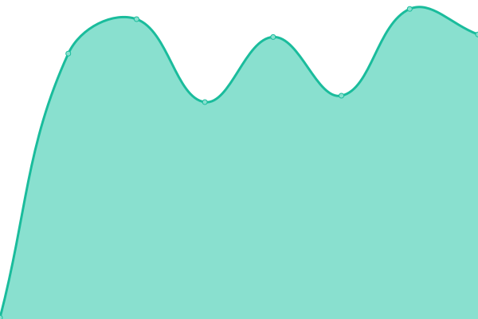
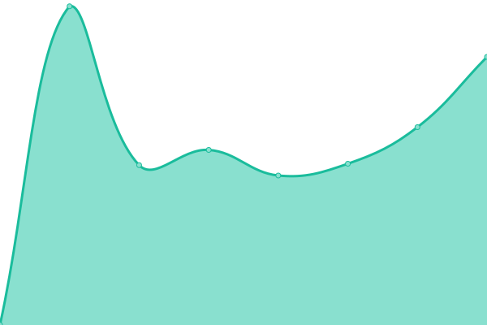

# [📈 Live Status](https://demo.upptime.js.org): <!--live status--> **🟩 All systems operational**

This repository contains the open-source uptime monitor and status page for [Upptime](https://upptime.js.org), powered by [Upptime](https://github.com/upptime/upptime).

With [Upptime](https://upptime.js.org), you can get your own unlimited and free uptime monitor and status page, powered entirely by a GitHub repository. We use [Issues](https://github.com/upptime/upptime/issues) as incident reports, [Actions](https://github.com/upptime/upptime/actions) as uptime monitors, and [Pages](https://demo.upptime.js.org) for the status page.

<!--start: status pages-->
<!-- This summary is generated by Upptime (https://github.com/upptime/upptime) -->
<!-- Do not edit this manually, your changes will be overwritten -->
<!-- prettier-ignore -->
| URL | Status | History | Response Time | Uptime |
| --- | ------ | ------- | ------------- | ------ |
|  [Website](https://www.seven-ig.de) | 🟩 Up | [website.yml](https://github.com/c0ball/Uptime/commits/HEAD/history/website.yml) | 

 1403ms
     
 | 

<a href="https://c0ball.github.io/Uptime/history/website">99.75%</a>
    

|  [Forum](https://www.seven-ig.de/phpBB3/) | 🟩 Up | [forum.yml](https://github.com/c0ball/Uptime/commits/HEAD/history/forum.yml) | 

 208ms
     
 | 

<a href="https://c0ball.github.io/Uptime/history/forum">99.75%</a>
    

|  Cobal | 🟩 Up | [cobal.yml](https://github.com/c0ball/Uptime/commits/HEAD/history/cobal.yml) | 

 898ms
     
 | 

<a href="https://c0ball.github.io/Uptime/history/cobal">99.76%</a>
    

<!--end: status pages-->

[**Visit our status website →**](https://demo.upptime.js.org)

## 📄 License

- Code: [MIT](./LICENSE) © [Upptime](https://upptime.js.org)
- Data in the `./history` directory: [Open Database License](https://opendatacommons.org/licenses/odbl/1-0/)
